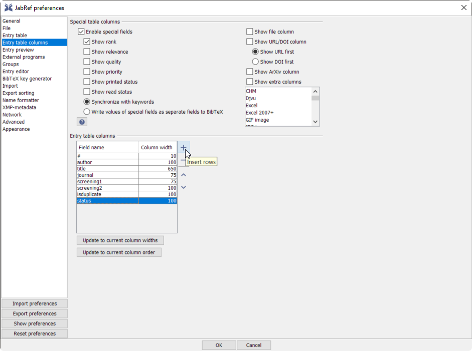
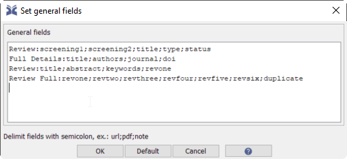

```{r setup, include=FALSE}
########################################################################
### Load packages
########################################################################
 
require('userfriendlyscience');  ### For convenience functions, e.g. 'safeRequire'
safeRequire('here');             ### To easily access files using 'relative paths'
safeRequire('plyr');             ### For easily processing and restructuring data
safeRequire('dplyr');            ### Also for easily processing and restructuring data
safeRequire('purrr');            ### Iteration and the %||% operator
safeRequire('tidyr');            ### To tidy data to long dataframes
safeRequire('lubridate');        ### For working with dates
safeRequire("googlesheets");     ### To import data from google sheets in metabefor
safeRequire('jsonlite');         ### To import a list of country codes in metabefor
safeRequire('knitr');            ### For kable
safeRequire('ufs');              ### 
safeRequire('data.tree');        ### To work with data structured in a tree in metabefor
safeRequire('devtools');         ### To install metabefor from github repo
                                 ### ... Which we then do here:
devtools::install_github("Matherion/metabefor");
require('metabefor');

########################################################################
### Settings
########################################################################

### By default hide R code
knitr::opts_chunk$set(echo = FALSE);
knitr::opts_chunk$set(comment = NA);

### Set path for query hit exports
queryHitExportPath <- here::here("10-queries");

### Set path for screening
screeningPath <- here::here("20-screening");

### Set path for extraction script template
extractionScriptTemplatePath <- here::here("40-extraction");

### Set path for intermediate output
workingPath <- here::here("60-intermediate-results");

### Set path for figures
figPath <- here::here("70-figures");

### Create object to keep track of queries
queries <- list();

### Simple function to correctly capture figures
figCap <- function(caption) {
  figCapCounter <-
    ifelse(is.null(getOption('figCapCounter')),
           0,
           getOption('figCapCounter'));
  figCapCounter <- figCapCounter + 1;
  options(figCapCounter = figCapCounter);
  return(paste0("Figure ", figCapCounter, ": ", caption));
}

### Set figure counter to 0
options(figCapCounter = 0);

```

# Queries

<!--------------------------------------------------------------------->
<!-- Set up of first query (done before the corresponding header, as -->
<!-- the date in that header is read from this object) ---------------->
<!--------------------------------------------------------------------->

```{r first-query-setup}

queries[[length(queries) + 1]] <-
  list(date = ymd("2018-08-28"),
       query = query_full(
         inclusion = query_requiredConcepts(
           conceptName="FASD Programmes Query",
           query_conceptTerms(
             conceptName = "FASD",
             "fetal alcohol spectrum disorder*",
             "foetal alcohol spectrum disorder*",
             "fetal alcohol exposure",
             "foetal alcohol exposure",
             "fetal alcohol syndrome",
             "foetal alcohol syndrome",
             "partial fetal alcohol syndrome",
             "partial fetal alcohol spectrum disorder*",
             "partial foetal alcohol syndrome",
             "partial foetal alcohol spectrum disorder*",
             "prenatal alcohol exposure",
             "prenatal exposure to alcohol",
             "alcohol exposed",
             "alcohol related birth defects",
             "alcohol related neurodevelopmental disorder",
             "fetal effects",
             "alcoholic embryopathy"),
           query_conceptTerms(conceptName = "Pregnancy",
                              "pregnan*",
                              "gestat*",
                              "maternal",
                              "prenatal"),
           query_conceptTerms(conceptName = "Alcohol consumption",
                              "alcohol consumption",
                              "alcohol*",
                              "drink*"),
           query_conceptTerms(conceptName = "Prevention",
                              "preven*",
                              "interve*",
                              "strategy",
                              "education",
                              "health promot*",
                              "program*"))),
       exclude=query_conceptTerms(conceptName = "Exclusion",
                                  "animal*",
                                  "mouse",
                                  "mice",
                                  "rat",
                                  "rats",
                                  "zebrafish"),
       databases = list(psycinfo = list(interface = "ebsco",
                                        fileFormat = "ris"),
                        pubmed = list(interface= "pubmed",
                                      fileFormat = "ris")),
       fields = "title, abstract");

### Note that PsycINFO subsumes PsycARTICLES, and PubMed subsumes MEDLINE (see
### "Is PsycARTICLES cross-linked with any outside databases or journals?" at
### http://www.apa.org/pubs/databases/psycarticles/faq.aspx for PsycINFO and
### and http://askus.library.tmc.edu/faq/2018 for MEDLINE

```

## First query, executed at: `r queries[[1]]$date;`

The first query is:

```{r query1-visual, screenshot.force=FALSE}
plot(queries[[1]]$query);
```

In this plot, the 'AND' operator is visualised by a solid line, while the 'OR' operator is visualised by a dotted line.

In this query, the searched terms must occur in entries' `r queries[[1]]$fields` fields.

In the interface language of the PubMed interface to the PubMed database and the Ebscohost and Ovid interfaces to a variety of databases such as PsycINFO, PsycArticles, and MedLine, this query renders as:

```{r}
query_toInterfaceLang(queries[[1]]$query,
                      fields=queries[[1]]$fields,
                      exclude=queries[[1]]$exclude);
```

This query was run at `r queries[[1]]$date;` in PubMed (XXXX hits; file saved as <code>pubmed-`r queries[[1]]$date`.ris</code>) and PsycINFO accessed through EbscoHost (XXXX hits; file saved as <code>psycinfo-`r queries[[1]]$date`.ris</code>), and exported to RIS format (called 'MEDLINE' in PubMed). The RIS files were then imported in R using `metabefor`.

```{r echo=TRUE, eval=FALSE}

### Import PsycINFO hits
firstQueryIteration_psycinfo <-
  importRISlike(file.path(queryHitExportPath,
                          queries[[1]]$date,
                          paste0(queries[[1]]$date, "--",
                                 queries[[1]]$databases[[1]]$interface, "--",
                                 names(queries[[1]]$databases)[1], ".",
                                 queries[[1]]$databases[[1]]$fileFormat)),
                encoding="native.enc");

### Import PubMed hits
firstQueryIteration_pubmed <-
  importRISlike(file.path(queryHitExportPath,
                          queries[[1]]$date,
                          paste0(queries[[1]]$date, "--",
                                 queries[[1]]$databases[[2]]$interface, "--",
                                 names(queries[[1]]$databases)[2], ".",
                                 queries[[1]]$databases[[2]]$fileFormat)),
                encoding="native.enc");

### Merge the two sets of hits
firstQueryIteration <-
  findDuplicateReferences(primaryRefs = firstQueryIteration_psycinfo,
                          secondaryRefs = firstQueryIteration_pubmed,
                          duplicateFieldValue = "dupl",
                          newRecordValue = "PubMed",
                          duplicateValue = "duplicate (both PsycINFO and PubMed)",

### Generate bibtex keys
firstQueryIteration$output$records <-
  generateBibtexkeys(firstQueryIteration$output$records);

### Add query date identifier to bibtex keys
firstQueryIteration$output$records$bibtexkey <-
  paste0(firstQueryIteration$output$records$bibtexkey,
         "-", gsub("-", "", queries[[1]]$date));

screening1_filename_pre <- paste0(queries[[1]]$date, "-screening.bib");
screening1_filename_post <- paste0(queries[[1]]$date, "-screened.bib");

### Export the hits to bibtex for screening in JabRef
sysrevExport(firstQueryIteration,
             filename=file.path(screeningPath,
                                screening1_filename_pre),
             screeningType=NULL);

```

The merged list of query hits has now been exported to file <code>`r #screening1_filename_pre`</code> in directory "screening" and can be opened using JabRef, which can be downloaded from https://www.fosshub.com/JabRef.html.

## JabRef configuration

When opening a bibliographic library (i.e. a file with the extension `.bib`) in JabRef, it will show the entry table, which is a convenient way to inspect all entries (hits, references, articles, etc) in the library. To prepare JabRef for screening, two settings are important.

First, to change the fields that are visible in the overview table of all references (i.e. the entry table), open the 'Options' drop-down menu and select 'Preferences'. In the preferences dialog, open the 'Entry table columns' section:



There, the columns shown in the entry table can be edited in the 'Entry table columns' sections. A bit confusingly, this is done by adding *rows* in the table shown in this dialog. Each 'row' in this table represents a column in the entry table.

Note that in bibtex (and therefore JabRef), you can create new fields on the fly. In this case, use field 'screening1' for screening the hits of this first screening iteration: simply add this field name as a 'row' (column) in the entry table. This will show, for every entry, the contents of that field (if it has any).

Second, you need to be able to edit the content in that field. The entry table is very convenient to maintain an overview of the entries in the database, but cannot be used for editing. To edit an entry, double click it in the entry tabel. This opens the entry editor, which has a number of tabs. Each tab shows a number of fields which can then be edited.

These tabs can be configured by setting the 'General fields'. Open the 'Options' drop-down menu and select 'General Fields' to configure which fields are available in the different tabs when opening an entry. 



Add a dedicated field for the reviewing, showing only the title, abstract, and `screening1` fields. This allows you to focus on the relevant information while ignoring irrelevant and potentially biasing information (such as year, journal, and authors). Each row in this text area shows one tab. The first term on each row is the tab's name, followed by a colon (`:`) and then the fields shown in the tab, separated by semicolons (`;`). For example, you could add the following row:

`Screening Round 1:title;abstract;screening1`

## Screening process

For every entry, add the following text in the 'screening' field:

- If it is excluded, add the reason, specifically (these are ordered progressively; i.e. if one of the criteria matches, apply it and move on to the next entry):
    - **`dupl`** if the study is a duplicate of another entry;
    - **`noengl`** if the study is not reported in English;
    - **`noexper`** if the study does not have an experimental design;
    - **`nopopul`** if the study did not sample participants younger than 18 years;
    - **`noexpos`** if the study did not compare two groups that differ in the treatment in terms of exposure as a part of cognitive behavioral therapy;
    - **`nophobia`** if the study did not concern treatment for phobia disorders;
- If it is included, add **`incl`**.

So once JabRef is opened, when screening, make sure that the 'screening1' field is shown in the entry table (i.e. that it is one of the entry table columns), and create one entry editing tab using 'General Fields' that contains the fields `title`, `abstract`, and `screening1`. You can then use this tab for the screening. It is also convenient to show field `dupl` in either the entry table or the screening tab in the entry editor, because for duplicate records (that were identified as such - the algorithm may miss some duplicates of course), that field contains the text `dupl`.

Make sure to save the database with query hits under a different name than <code>`r #screening1_filename_pre`</code>. That is important because file <code>`r #screening1_filename_pre`</code> will get overwritten if this R Markdown file is executed again. This file will not require any adjustments if you name the database <code>`r #screening1_filename_post`</code>.

### Screening results {.tabset}

#### Overview

This is an overview of the screening results. The details for the sources to include are listed in the second tab.

```{r query-1-import-screened-hits-overview, eval=FALSE}

firstQueryScreened <-
  metabefor::importBibtex(file.path(screeningPath,
                                    screening1_filename_post));

userfriendlyscience::freq(firstQueryScreened$records$screening1);

```

#### Details

```{r query-1-import-screened-hits-details, results='asis', eval=FALSE}

firstQueryScreened$records %>%
  dplyr::filter(grepl("incl", screening1)) %>%
  dplyr::rowwise() %>%
  dplyr::do(
    data.frame(txt=paste0("\n\n##### ", .$bibtexkey, "\n\n",
                          .$author, " (", .$year, ") ",
                          .$title, ". ", .$journal, ". <a href='https://doi.org/",
                          .$doi, "'>", .$doi, "</a>\n\n",
                          .$abstract),
               stringsAsFactors = FALSE)
  ) %>%
  unlist() %>%
  cat(collapse="\n");

### Maybe start working with
# firstQueryScreened$records$bibtype <- firstQueryScreened$records$recordtype;
# row.names(firstQueryScreened$records) <- firstQueryScreened$records$bibtexkey
# RefManageR::PrintBibliography(RefManageR::as.BibEntry(head(firstQueryScreened$records, 1)),
#                               .opts=list(no.print.fields=setdiff(names(firstQueryScreened$records),
#                                                                  c('author',
#                                                                    'title',
#                                                                    'date',
#                                                                    'journal'))));

```


## Data extraction

### The extraction script (.rxs) {.tabset}

#### Generation of the extraction script

We will use a metabefor extraction script for the extraction of the data. The idea of this script is to extract the data from the original sources with a minimum of interpretation. The data is extracted into a machine-readable format, which then allows competely transparent further processing and synthesis.

These scripts are generated on the basis of two tables/spreadsheets. The first contains the entities to extract, such as study year, sample size, how variables were operationalised, and associations that were found. The second contains the valid values for each entity, to allow efficiently providing coders with examples, instructions, and to allow easy verification of the input.

The logged messages from this process are available in this section under the tab 'Logged messages', and the generated extraction script template (which is also written as a file to the repository) is included in a text area in the 'Extraction script template' for convenient inspection.

#### Logged messages

```{r extraction-script-generation, eval=TRUE}

sheetsURL <- paste0("https://docs.google.com/spreadsheets/d/",
                    "1f4mpH0n5IiLKgmV4Ot9KbfTHFfRGhrs7ELb4QwKYlts");

valueTemplatesSheet <- "valueTemplates";
entitiesSheet <- "entities";

fullObject <-
  rxs_fromSpecifications(gs_url = sheetsURL,
                         entitiesFilename = file.path(extractionScriptTemplatePath,
                                                      "entities-local-copy.csv"),
                         valueTemplatesFilename = file.path(extractionScriptTemplatePath,
                                                            "valueTemplates-local-copy.csv"),
                         localBackup = list(entities = file.path(extractionScriptTemplatePath,
                                                                 "entities-local-copy.csv"),
                                            valueTemplates= file.path(extractionScriptTemplatePath,
                                                                      "valueTemplates-local-copy.csv"),
                                            definitions = NULL),
                         outputFile = file.path(extractionScriptTemplatePath,
                                                "extractionScriptTemplate.rxs.Rmd"),
                         returnFullObject = TRUE);

```

#### Extraction script template

```{r extraction-script-template, results="asis", eval=TRUE}
cat("\n\n<pre><textarea rows='40' cols='124' style='font-family:monospace;font-size:11px;white-space:pre;'>",
    unlist(fullObject$rxsTemplate),
    "</textarea></pre>\n\n",
    sep="\n");
```

### Software considerations

To do the actual extraction, there are two general routes an extractor can take. The first is to use R Studio. The advantage of using R Studio is that, because each extraction script file (rxs file) is in fact an R Markdown file, it can be rendered into a report for the extracted study immediately. This can show whether any mistakes were made during extraction, and easily allows the extractor to check the results of their labour.

However, a disadvantage of R Studio is that R Markdown files are always wrapped. Wrapping means that to prevent the need for horizontal scrolling, long lines of text are displayed on multiple lines. Wrapping is almost always very useful. Text processors, for example, always wrap; text in books is always wrapped; and so is online content.

However, extraction scripts contain very long lines when closely related entities are extracted in list form; in that case, their explanation and examples are placed as comments (preceded by R's comment symbol, `#`) behind the entities and values to extract, which can look very confusing if lines are wrapped.

RStudio does use syntax coloring to clearly indicate which parts of the extraction script are comments and which parts are values, but still, extractors might find this confusing.

The second option, therefore, is to use an external editor. For extractors working in a Windows environment, Notepad++ is recommended; for extractors working in a Mac OS environment, BBEdit is recommended (extractors using a Linux distro probably already have their preferred text editors).


#### Downloading the software

Working with RStudio requires installing R as well.

- R can be downloaded from [this link](https://cloud.r-project.org/) (specifically from [this link](https://cloud.r-project.org/bin/windows/base/) for Windows, from [this link](https://cloud.r-project.org/bin/macosx/) for MacOS, and through [this link](https://cloud.r-project.org/bin/linux/) for Linux).
- RStudio can be downloaded from [this link](https://www.rstudio.com/products/rstudio/download/#download).
- Notepad++ can be downloaded from [this link](https://notepad-plus-plus.org/download).
- BBEdit can be downloaded from [this link](https://www.barebones.com/products/bbedit/download.html) (the free version suffices).

### Extraction guidelines

#### Overview of the extraction process

When extracting articles, an extractor takes the following steps:

- Open the article (this usually means opening the relevant PDF in the `pdfs` directory).

- Copy the extraction script template to a new file in the `extraction` directory in the study repository.

- Give the new file a name conform the following convention: a list of the last names of all authors, all in lower case (i.e. without capitals), separated by dashes (`-`), and ending with the year of the study, separated from the list of author names by two dashes (`--`), and ending with the extraction script extension (`.rxs.Rmd`). Thus, the filename should look something like this: `boys-marsden--2003.rxs.Rmd`.

- Open the new (and newly renamed) extraction script in the editor of choice (see the 'Software considerations' section above).

- If you haven't looked at the extraction script yet, study it. If you encounter anything you're uncertain about, contact another team member to ask them to explain it.

- In the extraction script, scroll to the line containing the text `START: study (ROOT)`.

- Work your way through the extraction script, completing each applicable extractable entity and removing those that cannot be extracted (see section 'Extracting entities' below). Often, the first entity will be the study identifier (usually a Digital Object Identifier or DOI), but completing an extraction script is often a nonlinear activity, starting with the primary entities of interest.

- Once you have completed the extraction script, if you use RStudio, you can 'render' or 'knit' it by clicking the 'Knit' button at the top. This will show you what you extracted. If you made any errors (e.g. forgot a comma, or a single or double quote, or forgot to open or close a parenthesis, or mistyped a variable name, etc), this should become clear at this point. Correct any errors. (If you use another editor, you won't be able to check this at this point.)

- Repeat these steps for the next article.

In this process, apply the steps explained in the 'Extracting entities' section below. Note that in some cases, you will have to make a choice as to how to extract (code) certain information. The decisions that have already been taken to guide these choices have been listed in the 'Coding decisions' section below.

If you run into any problems, clearly write them down, and depending on what you agreed with your team members, accumulate these issues and discuss them at the next meeting, or immediately pass them on using whichever medium you use for coordinating study progress.

#### Extracting entities

The extraction process consists of extracting facts from published reports of empirical research (not always, but almost always). Extraction consists of two steps: studying the report and interpreting its contents to determine what is to be extracted (also called *coding*) and the actual extraction (documenting the extracted facts). When using `metabefor` (and we do), facts that can be extracted are called *entities*. So, can *entity* is one datum (singular of data) to be extracted, such as a year, a sample size, the measurement level of a variable, a precentage, or an effect size. Extraction scripts (i.e. `.rxs.Rmd` files) contain a long list of these entities.

##### Single entities

Some entities are just single entities. For example, this is an example of the extraction script fragment for extracting a sample size:

    ############################################################################
    ############################################################### START: N ###
    ############################################################################
    study$methods$AddChild('N');
    study$methods$N[['value']] <-
    ############################################################################
    ### 
    ### SAMPLE SIZE
    ### 
    ### Total number of human participants in the study (note: the
    ### actual sample size may be larger if multiple observations are
    ### collected per participant)
    ### 
    ############################################################################
        
        NA
        
    ############################################################################
    ######################################### VALUE DESCRIPTION AND EXAMPLES ###
    ############################################################################
    ### 
    ### Any valid whole number
    ### 
    ### EXAMPLES:
    ### 
    ### 30
    ### 8762
    ### 
    ############################################################################
    study$methods$N[['validation']] <- expression(is.na(VALUE) || (is.numeric(VALUE) && (VALUE%%1==0) && (length(VALUE) == 1)));
    ############################################################################
    ################################################################# END: N ###
    ############################################################################

This excerpt has a number of fragments. As an extractor, not everything is relevant. When extracting, the relevant fragments are the following:

    START: N

This signifies that an *entity block* starts to extract the entity with the *identifier* (a unique name of this entity) `N`. For entity blocks that are *repeating* blocks, this identifier is followed by `(REPEATING)`. Entity blocks that are repeating have to be copied and pasted in the extraction script as often as is required. When copy-pasting, copy-paste the entire entity block.

    SAMPLE SIZE

This is the 'human readable' (i.e. nicely worded) name for this entity. This will normally just be a clearer version of the identifier.

    Total number of human participants in the study (note: the
    actual sample size may be larger if multiple observations are
    collected per participant)

This is the explanation of what exactly this entity is (i.e. what an extractor should look for in the report, and how to code it).

    NA

In between this description of what to code and the following section (see next fragment), the extracted value is entered (this fragment is called the *extracted value fragment*). In the extraction script template, the default value as specified in the extraction script specification (three spreadsheets that together specify the entities, value templates, and definitions, and that are parsed by `metabefor` to generate the extraction script template) is prefilled. `NA` stands for a missing value, in other words, something that has not been extracted yet. Depending on what is specified in the extraction script specification, `NA` can be a valid value or an invalid value (i.e. if something *must* be extracted). Another common default value is `""` to signify an empty text string.

    VALUE DESCRIPTION AND EXAMPLES

This fragment contains a description of the valid values for this entity as well as some examples. This fragment ends with the entity block ending:

    END: N

Like for the entity block start, if the entity block is *repeating* (i.e. describes an entity or entity list that can be extracted multiple times in one report), the identifier (in this example, `N`) is followed by `(REPEATING)`.

##### Entity lists

Closely related entities can be combined into an *entity list* for convenience's sake. *Entity lists* look very similar to single entities, but instead of providing a space for extracting a single value in the *extracted value fragment*, they combine multiple extractable entities in a list (for example, univariate results pertaining to a variable; or associations pertaining to two variables). This list always contains pairs of extractable entities' names, equals signs (`=`), and the default value, and these pairs are delimited by comma's (`,`). The list of pairs is always preceded by the text `list(` and followed by a closing parenthesis and a semicolon (`);`). In entity lists, the explanation of each value as well as the examples are included in comments behind each name-value pair:

    ##########################################################################
    ############################### START: operationalisations (REPEATING) ###
    ##########################################################################
    study$methods$variables$AddChild('operationalisations__1__');
    study$methods$variables$operationalisations__1__[['value']] <-
    ##########################################################################
    ### 
    ### OPERATIONALISATIONS
    ### 
    ### The operationalisations (measurements or manipulations)
    ### used in the study
    ### 
    ##########################################################################
        
        list(oper.name = "Enter name here (mandatory)",  ### Variable Name: A unique name (in this study), to be able to refer to this variable later, and to easily find it afterwards [Examples: "Example"; "Another example"] [Value description: A single character value that cannot be omitted]
             oper.moment = 1,                            ### Moment: Moment(s) this variable was measured/manipulated. [Examples: c(23, 62); 52; c(76, 12, 42)] [Value description: A vector of integers (i.e. one or more whole numbers)]
             oper.type = NA,                             ### Type of operationalisation: Whether this variable is a manipulation, a single measurement, or an aggregate [Examples: c("manipulation", "item", "aggregate")] [Value description: A string that has to exactly match one of the values specified in the "values" column of the Coding sheet]
             oper.datatype = NA,                         ### Type of data: "Measurement level" of this operationalisation. [Examples: c("numeric", "logical", "nominal", "ordinal", "string")] [Value description: A string that has to exactly match one of the values specified in the "values" column of the Coding sheet]
             oper.values = NA,                           ### Values: Possible values this variable can take: only valid for "nominal" or "ordinal" variables. [Examples: c(23, 62); 52; c(76, 12, 42)] [Value description: A vector of integers (i.e. one or more whole numbers)]
             oper.labels = NA,                           ### Labels: Labels for the values. [Examples: c("First value", "Second value")] [Value description: A character vector (i.e. one or more strings)]
             oper.description = "",                      ### Description: A description of this variable (can be more extensive than the name) [Examples: "Example"; "Another example"] [Value description: A single character value]
             oper.comment = "");                         ### Comment: Any relevant comments the coder wants to add [Examples: "Example"; "Another example"] [Value description: A single character value]
        
    ##########################################################################
    study$methods$variables$operationalisations__1__[['validation']] <- list(`oper.name` = expression(!is.na(VALUE) && !is.null(VALUE) && (nchar(VALUE) > 0)),
                                                                             `oper.moment` = expression(is.na(VALUE) || (is.numeric(VALUE) && all(VALUE%%1==0))),
                                                                             `oper.type` = expression(is.na(VALUE) || (VALUE %in% c("manipulation", "item", "aggregate"))),
                                                                             `oper.datatype` = expression(is.na(VALUE) || (VALUE %in% c("numeric", "logical", "nominal", "ordinal", "string"))),
                                                                             `oper.values` = expression(is.na(VALUE) || (is.numeric(VALUE) && all(VALUE%%1==0))),
                                                                             `oper.labels` = expression(is.na(VALUE) || (is.character(VALUE))),
                                                                             `oper.description` = expression(is.na(VALUE) || (is.character(VALUE) && length(VALUE) == 1)),
                                                                             `oper.comment` = expression(is.na(VALUE) || (is.character(VALUE) && length(VALUE) == 1)));
    study$methods$variables$operationalisations__1__$name <- study$methods$variables$operationalisations__1__$value[['oper.name']];
    ##########################################################################
    ################################# END: operationalisations (REPEATING) ###
    ##########################################################################

##### How to go about extraction

Literature syntheses are usually about results from empirical investigations. Therefore, usually univariate results or associations are the primary entity of interest. Therefore, it is usually a good idea to start the extraction with looking for the primary entity (or entities) of interest. For example, if the literature synthesis is about an effect size (i.e. an association), but a report does not provide any information about the relevant association, it may be necessary to contact the authors (see the section 'Communication with authors' below). Alternatively, it may be necessary to extract not the association, but univariate results, that will later allow computing the association (see section 'When associations are not reported').

If the primary entities of interested are located and extracted, then the included operationalisations (i.e. manifestations of the variables of interest) can be extracted, and in that case, it is also clear that it is worthwhile to extract the methodological details of the study. Thus, in practice, completing an extraction script is a nonlinear process.

##### Results: univariate, bivariate, and multivariate

Data collection yields two kinds of data: data representing manipulations and data representing measurements.

The values of the first type are determined by the study's design: for example, in a simple two-cell experiment, such as a randomized controlled trial with two arms, participants in one condition (or 'arm') can receive either a placebo ('control condition') or an intervention or therapy ('experimental condition'). In such designs, the condition into which each participant is randomized is usually denoted by a 0 or a 1, which is entered as a variable into the datafile. These values, however, aren't provided by the participants; they don't represent collected data, but instead describe the study design, specifically as it pertains to each participant.

The values of the second type, by contrast, usually result from the registration of participants' responses to stimuli (e.g. participants can endorse certain answer options after having been presented with questions in a questionnaire). For data of this type, realistic ranges for the data will be known in advance (e.g. a questionnaire may register responses on a 5-point scale), but the distributions of the data are unknown (e.g. means, standard deviations, distribution shapes, etc).

The goal of empirical research in psychology is often to estimate the association between two (or sometimes more) variables (if a research question concerns causality, at least one variable is operationalised as a manipulation; otherwise, both may be operationalised as measurements).

Datasets (sets of one or more data series, where a data series is a set of one or more data points, where a data point is one number that represents a value of an operationalisation, e.g. a 0 or a 1 representing a manipulation, or a 4 representing the registered reponse in a questionnaire) can be subjected to many different analyses. In the context of research syntheses such as systematic reviews and meta-analyses, it is useful to distinguish three types of analyses: univariate analyses, bivariate analyses, and multivariate analyses.

###### Univariate analyses

Univariate analyses are analyses conducted on one data series. This can be a data series as collected (e.g. the responses registered from participants for one item in a questionnaire) or a data series that represents an aggregation of multiple data series (e.g. a mean of the data series that each represent participants' answers to a different item in a questionnaire). Univariate analyses by definition do not provide information about associations between variables, but only about the distributions of data points. Examples of univariate results are:

- sum scores (i.e. all data points added together)
- means (i.e. sum scores divided by the number of data points)
- medians (i.e. the 'middle value' after all data points were sorted)
- standard deviations (i.e. the average deviation of the data points from the mean)
- variances (i.e. the squared standard deviation)
- sum of squares (i.e. the sum of the squared deviations of each data point from the mean)
- skewnesses (i.e. the third standardized moment of a data series; whether the distribution deviates from symmetry)
- kurtosises (i.e. the fourth standardized moment of a data series; how 'pointy' versus 'flat' a distribution is compared to the standard normal distribution).
- percentages or proportions, if the variable is dichotomous or otherwise categorical

Like any number estimated from a sample, the point estimate for each of these results will vary from sample to sample due to sampling and measurement error. Therefore, each univariate result may be reported with confidence intervals as well.

Univariate results are normally not reported for data series that represent manipulations.

###### Bivariate analyses

Bivariate analyses are analyses conducted on two data series. Again, the data series may be aggregates of other data series, and if a design is experimental, the main research question is usually answered by an analysis that includes a data series representing a manipulation. 

In the frequentist tradition, there are two types of bivariate analyses: tests and effect sizes. Tests are used in a null hypothesis significance testing framework, and were traditionally means to arrive at p-values. Test statistics and p-values provide no information about the strength of an association unless the corresponding degrees of freedom are taken into account. Effect sizes do the opposite: they provide information as to the strength of an association. If both effect sizes and test statistics are available, effect sizes should be extracted instead of test statistics (unless both are extracted, which would then allow rudimentary verification of the reported results).

There are a few common bivariate test statiatics:

- The t-test (Student's t-test, for equal variances, or Welch's t-test, for unequal variances)
- The F-test for oneway anova (the regular F-test, or Wald's correction for unequal variances)
- The Chi-squared test for cross tables

There are also a few common bivariate effect sizes:

- The correlation coefficient (Pearson's product moment correlation for continuous data or Spearman's rank correlation for ordinal data; usually tested using a t-test)
- Cohen's d (used when t-tests are used as a test statistic)
- Cramer's V (used for cross tables)
- Odds Ratio's, Risk Ratio's, or Relative Risks (all closely related)

###### Multivariate analyses

Sometimes researchers report multivariate results: results based on more than two data series. In the context of research syntheses, this can be challenging: estimates from multivariate analyses are conditional upon the entire model (i.e. all data series in the model). In other words, it is not always possible (and will often be problematic) to meta-analytically aggregate effect sizes from bivariate analyses and from multivariate analyses; or from multivariate analyses alone, unless those analyses were the same.

There are a few common multivariate analyses:

- Factorial anova
- Multiple regression
- Structural equation modeling
- Multi-level modeling

If in a multivariate analyses, the predictors are all independent (orthogonal, not associated to each other), for example if the  factors in a factorial anova represent conditions in an experiment with equal cell sizes, and not covariates were included, the results *can* be aggregated without any problems.

##### When associations are not reported or only associations from multivariate analyses are reported

When associations are not reported, look for univariate data, such as means and standard deviations. In an experimental design with multiple measurement moments, each of these extracted univariate results must have a specified measurement moment and a specified value for the subsample. The subsamples, then are defined as arms of the experiment (e.g. values of the manipulated variable). This requires defining a subsample for every arm, as well as variables (or more accurately, operationalisations) for the manipulation (or treatment, or intervention, etc) and the dependent variable(s). In addition, the values of these variables (i.e. the treatment, which will be, for example, 0 or 1 to denote absence or presence, and a dependent variable, which can be, for example, a mean and a standard deviation). Therefore, in this case, you need to extract five entity lists to store one set of univariate results. To illustrate this, an example of each of these five entity lists (in these examples, only the *extracted value fragments* are shown):

    list(subsample.name = "waitinglist",
         subsample.N = 14,
         subsample.age = NA);

This entity list (with three extracted entities) specifies a subsample. This subsample codes for one group in the experiment: we will specify which group below. Splitting the sample into subsamples enables specifying, for example, the mean for this subsample.

    list(oper.name = "treatment",
         oper.moment = c(1, 2),
         oper.type = "manipulation",
         oper.datatype = "logical",
         oper.values = c(0, 1),
         oper.labels = c("Control", "Experimental"),
         oper.description = "The treatment arms",
         oper.comment = "");

This entity list specifies an operationalisation. This operationalisation is the manipulation in an experimental design (as can be seen from `oper.type`), with three possible conditions (`Control` and `Experimental`). This operationalisation allows us to specify that the `waitinglist` subsample is the `Control` group in this study. Extracted entity `oper.moment` shows that this study has (at least) two measurement moments, and that this operationalisation is the same at both moments (in other words, given that this concerns the manipulation, this simply means that participants, once randomized into their condition, stay in that condition at the second measurement moment).

    list(oper.name = "SCARED",
         oper.moment = c(1, 2),
         oper.type = "aggregate",
         oper.datatype = "numeric",
         oper.description = "The SCARED questionnaire",
         oper.comment = "");

This second operationalisation specifies a dependent variable called `SCARED`, a measurement instrument for symptoms of anxiety disorders. This is the variable of which we will want to extract the mean and standard deviation for the control condition. This operationalisation, too, is the same at both measurement moments (`oper.moment = c(1, 2)` means that this information pertains to both measurement moments).

    list(uni.name = "treatment_t1_control",
         uni.variable = "treatment",
         uni.subsample = "waitinglist",
         uni.moment = c(1, 2),
         uni.category = 0);

This univariate result codes the condition of this subsample: variable `treatment` (as specified in the relevant operationalisation entity list) has value `0` at moments `1` and `2` for subsample `waitinglist`. Combined with the operationalisation specified earlier, this means that this subsample is in the control condition.

    list(uni.name = "symptoms_t1_control",
         uni.variable = "SCARED",
         uni.subsample = "waitinglist",
         uni.moment = 1,
         uni.mean = 26.93,
         uni.sd = 4.56,
         uni.comment = "Extracted from Table 2, page 71");

Finally, now that subsample has been defined; both variables have been defined; and the condition of this subsample has been defined; the actual univariate results of interest can be coded. In this case, this concerns a mean and a standard deviation. Two means, standard deviations, and the corresponding sample sizes allow computing Cohen's d, an effect size measure. `metabefor` will handle these conversions.

#### Coding decisions taken in this study

##### When multiple outcomes are reported

- When outcomes for multiple psychopathologies are reported, only fear or anxiety is extracted.

- When multiple outcome measures are reported, self-reported symptoms (or reduction in reported symptoms) is extracted.

- When multiple self-reported symptoms are reported, both for anxiety in general and for one or more specific anxiety disorders, anxiety in general is extracted.

- When multiple outcome measures are reported, the measure that measures fear or anxiety at the most generic level is extracted (e.g. measures of specific anxiety disorderd are avoided to the benefit of generic measures whenever possible).

- When multiple measurement moments were reported, the measurement moment immediately following the conclusion of the therapy sessions was extracted.

- When coding the therapy ingredients, because authors generally do not list everything that was _not_ done in a therapy protocol, absence is generally coded as such based on how authors describe the therapy. For example, absence of an ingredient can be sensibly inferred if presence of that ingredient would be incompatible with other ingredients that _were_ present, or with the rationale of the therapy as described in the manual. In the rare cases where absence of an ingredient _is_ explicitly stated in the therapy description or manual, this will be indicated in the study description.

### Communication with authors

If during the extraction process, you need to request additional information from the authors, follow the following steps:

- Open the directory `communications` in the study repository;
- Open the general template, called 'requesting-additional-info.Md';
- Save the template under a different name, where the name matches the base filename used for the extraction script (see section 'Overview of the extraction process') appended by `--communication` and with the same `.Md` extension (e.g. `boys-marsden--2003--communication.Md`);
- Edit the template as appropriate;
- Open the communications log by opening file `communications-log.Md` in the `communications` directory in the study repository;
- Depending on what was decided regarding communication with authors, send the email to the author or send it to whoever in the team was designated as responsible for handlign the communication with authors;
- Log this action in the communications log.

## List of therapy ingredients

This table shows the list of therapy ingredients to be coded, for easy access and scrutiny, since it's so central to this study.

```{r therapy-ingredient-list, eval=FALSE}

data.frame(Name=fullObject$rxsStructure$parsedEntities$extractionScriptTree$methods$variables$treatments$Get('title'),
           Description=fullObject$rxsStructure$parsedEntities$extractionScriptTree$methods$variables$treatments$Get('description')) %>%
  knitr::kable();

```

# Importing extraction scripts

```{r extraction-script-importing, eval=FALSE, fig.width=22, fig.height=8}

rxs <-
  metabefor::rxs_parseExtractionScripts(extractionScriptTemplatePath);

### Loop through the rxs trees and collect treatment information
treatments <-
  plyr::ldply(names(rxs$rxsTrees), function(studyName) {
    ### Get the values stored in the first child in the 'treatments' node
    if ('rxs' %in% class(rxs$rxsTrees[[studyName]])) {
      rxsTreeNode <- FindNode(rxs$rxsTrees[[studyName]],
                              'treatments');
      if (!is.null(rxsTreeNode$children)) {
        res <- as.data.frame(rxsTreeNode$children[[1]]$value);
        res$study <- studyName;
      } else {
        res <- data.frame(study = studyName);
      }
    } else {
      res <- data.frame(study = studyName);
    }
    return(res);
  });

knitr::kable(treatments);

```

## Study details

```{r studyDetails, eval=FALSE}

### Loop through the rxs trees and collect treatment information
studyDetails <-
  plyr::ldply(names(rxs$rxsTrees), function(studyName) {
    ### Get the values
    if ('rxs' %in% class(rxs$rxsTrees[[studyName]])) {
      methodsNode <- FindNode(rxs$rxsTrees[[studyName]],
                              'methods');
      studyNode <- FindNode(rxs$rxsTrees[[studyName]],
                            'study');
      ageValue <- ufs::vecTxt(methodsNode$age$value,
                              lastDelimiter="-");
      anxietyValue <- ufs::vecTxt(methodsNode$anxiety$value);
      nValue <- ufs::vecTxt(methodsNode$N$value);
      countryValue <- ufs::vecTxt(studyNode$country$value);
      treatmentName <- FindNode(rxs$rxsTrees[[studyName]],
                                'treatments')$children[[1]]$name;
      manualAvailable <- FindNode(rxs$rxsTrees[[studyName]],
                                  'treatments')$children[[1]]$value$treatment.manualAvailable;
      operNames <- unlist(lapply(FindNode(rxs$rxsTrees[[studyName]],
                                          'variables')$children,
                                 function(node) {
                                   return(node$name);
                                 }));
      operNames <- operNames[grep('treatment', operNames, invert=TRUE, value=TRUE)];

      briefStudyName <- 
        gsub("^([[:alpha:]]+)-.*([[:digit:]]{4})\\.rxs\\.Rmd",
             "\\1 et al. (\\2)",
             studyName);
      
      ### Convert first character to uppercase
      briefStudyName <-
        gsub("^([a-z])",
             "\\U\\1",
             briefStudyName,
             perl=TRUE);
      
      res <- data.frame(study = briefStudyName %||% NA,
                        treatmentName = treatmentName %||% NA,
                        manualAvailable = manualAvailable %||% NA,
                        age = ageValue %||% NA,
                        anxiety = anxietyValue %||% NA,
                        N = nValue %||% NA,
                        country = countryValue %||% NA,
                        operNames = operNames %||% NA,
                        stringsAsFactors = FALSE);
      return(res);
    } else {
      return(NULL);
    }
  });

write.csv(studyDetails,
          file=file.path(workingPath,
                         "study-details.csv"),
          row.names=FALSE);

knitr::kable(studyDetails);

```
